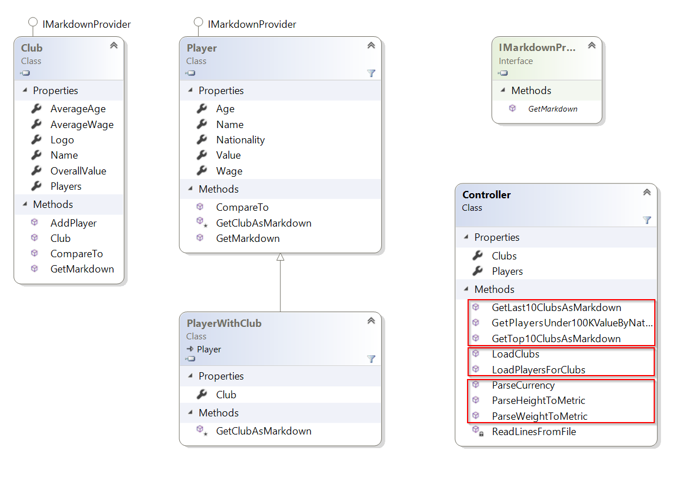
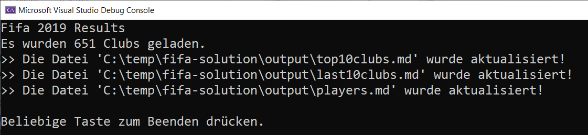

# Fifa 2019 - Auswertung

# Lernziele

* .NET Collections
* Objektorientierte Programmierung
* Deltaprogrammierung
* Einlesen von csv-Dateien

# Allgemein

Implementieren Sie eine Auswertung der Fifa 2019 Spieler.

Dazu sollen folgende Aspekte herausgearbeitet werden:

1. Top 10 Clubs  (`Controller.GetTop10ClubsAsMarkdown`)
   * Liste die Top 10 Clubs nach deren Gesamtwert deren Player auf.
   * Sortierung: Absteigend nach dem Gesamtwert. (Achtung: verwenden Sie hierzu einen eigenen Comparer).
   * Gesuchtes Ergebnis
   
        | Name                | Players | AverageAge |  AverageWage |    OverallValue |
        |---------------------|--------:|-----------:|-------------:|----------------:|
        | FC Barcelona        |      33 |      23,85 | 146.575,76 € | 4.819.800.000 € |
        | Real Madrid         |      33 |      24,03 | 152.030,30 € | 4.654.425.000 € |
        | Manchester City     |      33 |      23,91 | 113.363,64 € | 4.149.855.000 € |
        | Inter               |      24 |      27,46 |  66.500,00 € | 3.730.785.000 € |
        | Tottenham Hotspur   |      33 |      24,61 |  79.484,85 € | 3.522.750.000 € |
        | Paris Saint-Germain |      30 |      24,57 |  72.033,33 € | 3.370.325.000 € |
        | Manchester United   |      33 |      24,76 | 102.757,58 € | 3.231.250.000 € |
        | Juventus            |      25 |      27,16 | 131.680,00 € | 3.223.575.000 € |
        | Atlético Madrid     |      33 |      23,76 |  46.454,55 € | 3.196.925.000 € |
        | FC Bayern München   |      29 |      24,31 |  78.827,59 € | 2.999.225.000 € |

   
   * Darstellung per Markdown 
      * Beispiel
         ```markdown  
        | Name                | Players | AverageAge |  AverageWage |    OverallValue |
        |---------------------|--------:|-----------:|-------------:|----------------:|
        | FC Barcelona        |      33 |      23,85 | 146.575,76 € | 4.819.800.000 € |
        | Real Madrid         |      33 |      24,03 | 152.030,30 € | 4.654.425.000 € |
         ```
      * [Markdown Cheat Sheet](https://github.com/adam-p/markdown-here/wiki/Markdown-Cheatsheet)

2. Last 10 Clubs (`Controller.GetLast10ClubsAsMarkdown`)

   * Liste die schwächsten 10 Clubs nach deren Gesamtwert deren Player auf.
   * Sortierung: Aufsteigend nach dem Gesamtwert. (Achtung: verwenden Sie hierzu einen eigenen Comparer).
   * Gesuchtes Ergebnis

        | Name                   | Players | AverageAge | AverageWage | OverallValue |
        |------------------------|--------:|-----------:|------------:|-------------:|
        | Guangzhou R&F          |      28 |      25,82 |      0,00 € |          0 € |
        | Bray Wanderers         |      23 |      22,22 |  1.000,00 € |  1.930.000 € |
        | Limerick FC            |      19 |      22,95 |  1.000,00 € |  2.040.000 € |
        | Derry City             |      18 |      22,11 |  1.055,56 € |  2.795.000 € |
        | Bohemian FC            |      25 |      21,48 |  1.000,00 € |  3.195.000 € |
        | Sligo Rovers           |      19 |      22,16 |  1.000,00 € |  3.295.000 € |
        | St. Patrick's Athletic |      23 |      25,09 |  1.000,00 € |  3.995.000 € |
        | Macclesfield Town      |      26 |      25,46 |  1.730,77 € |  4.645.000 € |
        | Morecambe              |      28 |      25,07 |  1.642,86 € |  4.710.000 € |
        | Cambridge United       |      28 |      24,54 |  1.892,86 € |  4.845.000 € |


   * Darstellung in Markdown
      * Beispiel
         ```markdown  
        | Name                   | Players | AverageAge | AverageWage | OverallValue |
        |------------------------|--------:|-----------:|------------:|-------------:|
        | Guangzhou R&F          |      28 |      25,82 |      0,00 € |          0 € |
        | Bray Wanderers         |      23 |      22,22 |  1.000,00 € |  1.930.000 € |
         ``` 
      * [Markdown Cheat Sheet](https://github.com/adam-p/markdown-here/wiki/Markdown-Cheatsheet)

3. Spielerübersicht (`Controller.GetPlayersUnder1KValueByNationAndValueAsMarkdown`)
   * Liste alle Player aller Clubs auf, welche unter einem Marktwert von € 100.000 liegen.
   * Sortierung: Aufsteigend nach Nationalität und absteigend nach dem Marktwert. (Achtung: verwenden Sie hierzu einen eigenen Comparer).
   * Achtung: Unterschiedliche Darstellung wenn Player einem Club angehört oder keinem Club angehört!
   * Gesuchtes Ergebnis
  
        | Name                   | Age |     Wage |    Value |     Nationality     | Club                                                                                         |
        |------------------------|----:|---------:|---------:|:-------------------:|:---------------------------------------------------------------------------------------------|
        | B. Bytyqi              |  21 |  1.000 € | 80.000 € |       Albania       |  Aalborg BK                             |
        | J. Carranza            |  37 |  3.000 € | 70.000 € |      Argentina      |  San Martin de Tucumán               |
        | L. Giovini             |  36 |  1.000 € | 70.000 € |      Argentina      |  Unión La Calera                     |
        | M. Galmarini           |  36 |  3.000 € | 70.000 € |      Argentina      |  Club Atlético Tigre                 |
        | J. Speroni             |  39 |  8.000 € | 60.000 € |      Argentina      |  Crystal Palace                        |
        | C. Muñoz               |  41 |  1.000 € | 60.000 € |      Argentina      |  CD Universidad de Concepción        |
        | E. Alarcón             |  25 |  2.000 € | 50.000 € |      Argentina      |  Patronato                           |
        | M. Caranta             |  39 |  2.000 € | 40.000 € |      Argentina      |  Club Atlético Talleres              |
        | J. Quiroga             |  36 |  2.000 € | 40.000 € |      Argentina      |  Belgrano de Córdoba                 |
        | L. Finochietto         |  21 |  1.000 € | 40.000 € |      Argentina      |  Argentinos Juniors                  |
        | L. Corti               |  37 |  2.000 € | 20.000 € |      Argentina      |  San Martín de San Juan              |
        | L. Paredes             |  24 |      0 € |      0 € |      Argentina      | -                                                                                            |
        | R. Ogle                |  19 |  1.000 € | 90.000 € |      Australia      |  Accrington Stanley                  |
        | A. Lesiotis            |  18 |  1.000 € | 90.000 € |      Australia      |  Melbourne City FC                   |
        | D. Djulbic             |  35 |  1.000 € | 90.000 € |      Australia      |  Perth Glory                         |
    
   * Darstellung in Markdown
      * Beispiel
         ```markdown  
        | Name                   | Age |     Wage |    Value |     Nationality     | Club                                                                                         |
        |------------------------|----:|---------:|---------:|:-------------------:|:---------------------------------------------------------------------------------------------|
        | B. Bytyqi              |  21 |  1.000 € | 80.000 € |       Albania       |  Aalborg BK                             |
        | J. Carranza            |  37 |  3.000 € | 70.000 € |      Argentina      |  San Martin de Tucumán               |
        | L. Corti               |  37 |  2.000 € | 20.000 € |      Argentina      |  San Martín de San Juan              |
        | L. Paredes             |  24 |      0 € |      0 € |      Argentina      | -                                                                                            |
        | R. Ogle                |  19 |  1.000 € | 90.000 € |      Australia      |  Accrington Stanley                  |
        | A. Lesiotis            |  18 |  1.000 € | 90.000 € |      Australia      |  Melbourne City FC                   |
         ```    
      * [Markdown Cheat Sheet](https://github.com/adam-p/markdown-here/wiki/Markdown-Cheatsheet)


# Klassendiagramm



## Controller

Der `Controller` stellt die Ablauflogik zur verfügung

1. Import-Logik 
   1. `LoadClubs`
      * Hierbei werden alle Clubs aus der csv-Datei eingelesen und sind danach über das Property `Clubs` von außen abrufbar.
   2. `LoadPlayersForClubs`
      * Hierbei werden die Player den zuvor eingelesenen `Clubs` zugeordnet.
      * Der Aufruf der Methode `LoadClubs` muss zuvor erfolgt sein - ansonsten muss eine `InvalidOperationException` ausgelöst werden!
1. Markdown-Generierungscode `GetTop10ClubsAsMarkdown`, `GetLast10ClubsAsMarkdown`, `GetPlayersUnder100KValueByNationalityAsMarkdown`
      * Diese drei Methoden dienen dazu den Markdown-Code für die drei Auswertungen zu generieren. Siehen Sie sich dazu die Markdown-Beispiel in der Auswertungsdefinition an.
1. Parse-Logik
      * Da manche Informationen (Währungen, Größe und Gewicht) in der csv-Datei als Zeichenkette bzw. nicht im metrischen System vorliegen, müssen diese korrekt geparst bzw. konviertiert werden.
      * Sehen Sie sich dazu die Hinweise in den Methodenkommentaren an (`ParseCurrency`, `ParseWeightToMetric` und `ParseHeightToMetric`). 
1. `IMarkdownProvider`
      * Dieser Vertrag muss von jeder Entität implementiert werden, welche im Markdown dargestellt werden soll (Hinweis: `Club` und `Player`).
      * Im Vertrag wird genau eine Methode gefordert: `GetMarkdown`. Diese liefert die Markdown-Representation der Entität.
1. `Player` / `PlayerWithClub`
      * Verwaltung von Playern und Playern mit einer Clubzugehörigkeit.
2. `Club`
      * Achtung: die Markdown-Ausgabe unterscheidet sich zwischen Playern mit/ohne Club!
      * Verwaltung der Clubs
      * Es können per `AddPlayer` Spieler hinzugefügt werden.
      * Eigenschaften für `AverageAge` ("Durchschnittsalter"), `AverageWage` ("Durchschnittseinkommen" => Durchschnittlisches Einkommen aller Player des Clubs) und `OverallValue` ("Gesamtmarktwert" => Summe der Werte der einzelnen Player des Clubs) .
      
## ConsoleApp

Implementieren Sie auch eine einfache Konsolen-Applikation, welche den Import der csv-Datei beim `Controller` anstößt und welche folgende Ausgaben tätigt:



Mit folgender bestehender Hilfsmethode können die resultierenden Markdown-Dateien (Endung `md`!) gespeichert werden:

```csharp
void WriteContentToFile(string fileName, string content)
```

Schlußendlich sollen folgende drei Dateien bei der Programmausführung erstellt werden:

1. `top10clubs.md`
1. `last10clubs.md`
1. `players.md`

# Hinweise

1. Verwenden Sie Deltaprogrammierung wenn immer es sinnvoll erscheint.
1. Das Projekt `FifaResults.ConsoleApp` muss als `Startup Project` definiert werden!
1. Die Ausgaben sollen analog der Beispiel formatiert werden!
1. Währungen können formatiert ausgegeben werden ([Details](https://docs.microsoft.com/en-us/dotnet/standard/base-types/standard-numeric-format-strings)).
1. Umrechnung Fuß/Zoll nach cm (z.B. 5'7)
   * 5 Zoll sind 12 Inches
   * 7 Inches sind 2,54 cm
   * 5 * 12 + 7 * 2,54 = 170,18 cm
1. Umrechung Pound nach kg (z.B. 159lbs)
   * 159 * 0.45359237 = 72,12 kg
1. Die UnitTests dürfen nicht verändert werden!
1. [Markdown Cheat Sheet](https://github.com/adam-p/markdown-here/wiki/Markdown-Cheatsheet)
